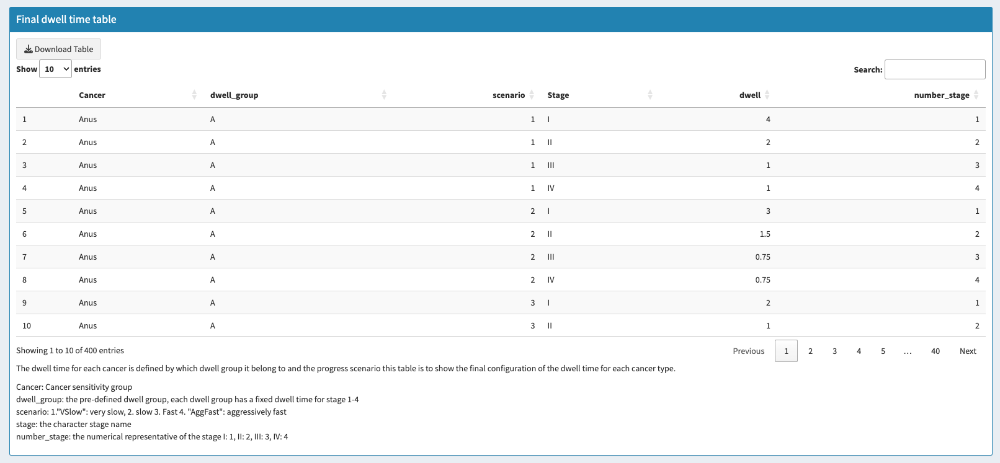

This is shiny-rized project of the original multi-cancer early detection.

The goal of this project is to develop user-friendly web application for simulate the detection power of multi-cancer early detection test under different scenarios, including: different dwell time setting, different cancer prevalence, different cancer detection sensitivity, and interval of the test.

# Quick start

You can access the web application through the following link:
https://chunhuigu.shinyapps.io/simulate_slip_rate/

The online application can be slow so please be patient.

Or download from github and run the following command in R console when you are at root directory of the project 
```
shinyAppDir('.', options = list())
```

# Instruction
# Step 1: Define different dwell scenarios
The first step is to define different dwell group. 
In the table there are four different groups: A, B, C, D, 
each group also have four different cancer progress scenarios: 1) very slow, 
2) slow, 3) fast, 4) aggresively fast
then for each group and progress scenario, the 1-4 cancer stage will a have a fixed dwell time


# Step 2: Select cancer group
The second step is to select the cancer group, the user can select the cancer group by clicking the button on the left side of the screen
The prevalence of cancer is loaded from SEER data, but user can simply modify the file to change the cancer prevalence.


# Step 2B: Final check the cancer dwell scenarios


# Step 3: Define the cancer detection sensitivity
We load the cancer detection sensitivity from the original multi-cancer early detection test,
but user can simply modify the file to change the cancer detection sensitivity.
Later a input feature will be added to allow on-fly change of the cancer detection sensitivity


# Step 4: Setting detection slip rate
The user can set the detection slip rate, which is the probability that the cancer is not detected by the test for a
stage and the cancer get into the next stage. The slip rate is defined by three parameter: the slip rate density model,
the expected dwell time for the cancer to stay in the stage, and the interval between screenings.
Here we use Weibull distribution (more distribution will be added later) to model the slip rate density.
User can slide to adjust weibull shape parameter and screen interval. The Cumulative slip probability plot will show
the cumulative slip probability for a stage of the cancer with dwell=4 for example.


# step 5: check simulation performance
This page show all important information for the simulation. The look-up table for the variable
can be found in the bottom of each page.


# Step 6: Reconstruct Flow Diagrams
The flow diagram shows the number of cases be detected at each stage of the cancer on scenarios: 
1. no interception (no test applied). 2. MIS (max interception scenarios) 3. Fast progress scenario
Number is shown per 1000 cases


# Step 7: Check sanky plot


# Step 8: Check the stage-shifting power
The stage-shifting power is defined as the probability that the cancer stage at detection 
is shifted to a lower stage when applying the test. The row represent the stage detected by standard care and the column
represent the stage detected by the test. The summation of each row is 100%.
